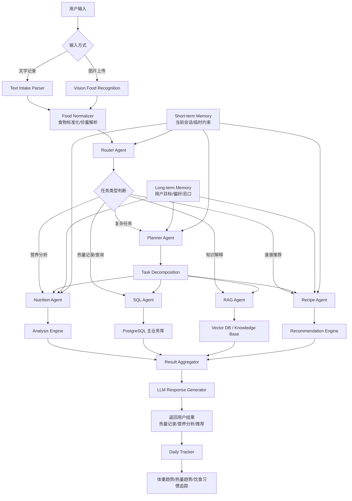
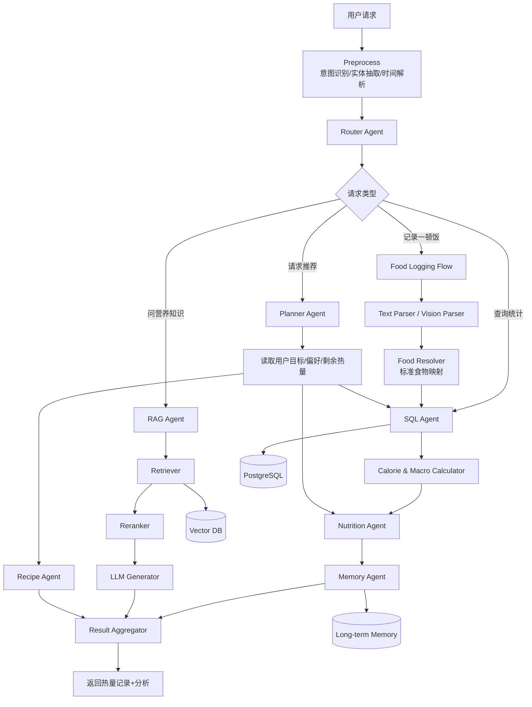

可以，而且我觉得这是个**明显更好的方向** 👍

你之前那个“多 Agent + RAG 的膳食营养助手”有个问题：**技术词很强，用户场景有点虚**。
面试官一旦追问“到底谁会用？核心闭环是什么？”，你就容易飘。

但你现在这个新定位：

> **AI营养师 + 饮食记录 + 热量记录 + 个性化食谱推荐**

就一下子落地了。因为它变成了一个**用户一眼就懂、你也容易讲清楚价值闭环**的产品：

- 每天吃了什么
- 记录多少热量
- AI 帮你分析是否合理
- 给出下一顿建议
- 长期追踪体重/目标
- 支持文字输入和拍照识别

这个方向既能保留你之前项目里的 **Agent / RAG / Memory / Text2SQL**，又比之前更像一个真实可用产品。
说难听一点，之前更像“为了技术而技术”；现在这个更像“技术服务于明确场景”。这就高级多了 😎

------

# 一、先给你结论：这个项目完全可以包装成 Agent / RAG 项目

而且包装方式比之前更自然。

## 你可以把它定义成：

**一个面向个人健康管理场景的多模态 AI 营养助手系统，支持饮食记录、热量估算、营养分析、个性化食谱推荐与长期健康管理。系统融合多 Agent 编排、RAG 检索、图像识别与用户记忆机制，实现从“记录—分析—建议—追踪”的闭环。**

这句话就很顺了。

因为你现在的功能链条是真实的：

```text
输入饮食 → 识别食物 → 估算热量 → 分析营养 → 结合用户目标给建议 → 推荐下一餐/食谱 → 长期跟踪
```

这比单纯“营养知识问答”强很多。

------

# 二、这个新项目应该怎么重新定位

我建议你不要再把项目核心写成：

> 多 Agent 协作与 RAG 架构的膳食营养智能助手

这句话太像技术论文标题，不像产品。

你应该改成这种更像产品、又能带出技术的定位：

## 定位版本 1：简历版

**基于多 Agent 与 RAG 的 AI 营养管理助手，支持饮食记录、热量分析、图像识别录入与个性化食谱推荐。**

## 定位版本 2：项目介绍版

**一个面向减脂/健康饮食场景的 AI 营养管理系统，支持用户通过文字或图片记录每餐饮食，自动完成食物识别、热量估算、营养分析，并结合用户目标生成个性化饮食建议与食谱推荐。**

## 定位版本 3：面试口语版

**我这个项目本质上是在做一个 AI 营养师，不只是回答营养问题，而是把饮食记录、热量计算、营养分析和个性化建议串成一个完整闭环。**

这个口语版很重要，面试时很好使。

------

# 三、这个项目的核心闭环是什么

你现在一定要先把脑子里的主线换掉。
以前你项目的主线像这样：

```text
用户提问 → Router → Planner → RAG / SQL → 回答
```

现在更好的主线应该是：

```text
用户记录一顿饭
→ 系统识别食物
→ 查询热量与营养数据
→ 结合用户目标分析
→ 给出评价与建议
→ 更新长期画像
→ 推荐下一餐/食谱
```

这才是一个真正有“持续使用价值”的系统。

所以你这个项目本质上不是“问答系统”，而是：

> **以 AI 为核心的饮食管理闭环系统**

这句话很值钱。

------

# 四、你这个项目现在最适合拆成 5 个核心模块

我直接给你规划成最稳的结构。

------

## 1）饮食记录模块

这是入口层，也是最强场景价值。

支持两种输入：

### 文字输入

例如：

- 我早餐吃了两个鸡蛋、一杯牛奶、两片全麦面包
- 中午吃了黄焖鸡米饭和一瓶可乐

### 图片输入

例如：

- 拍一张外卖照片
- 拍一张食堂餐盘照片

系统做的事：

- 识别食物名称
- 估算份量
- 映射到食物营养数据库
- 生成本餐记录

这一层就已经有“AI感”了，因为它不是死记账，而是“智能录入”。

------

## 2）热量与营养分析模块

这是系统的核心中台。

它要做的不是只给一个 kcal，而是输出：

- 总热量
- 蛋白质
- 脂肪
- 碳水
- 膳食结构是否合理
- 是否超出当前目标

例如：

> 本餐热量偏高，脂肪占比较高，蛋白质不足，不太适合减脂阶段长期食用。

你看，这里就已经很像“AI营养师”了，而不是普通卡路里计算器。

------

## 3）AI 营养问答与解释模块

这个就是你保留 **RAG** 的地方。

比如用户问：

- 红烧肉为什么不适合减脂？
- 晚上吃玉米和鸡蛋可以吗？
- 高蛋白早餐有哪些搭配？
- 低 GI 饮食是什么意思？

这些不是查表能解决的，需要营养知识解释。
这里就很适合做：

- 营养知识库
- 膳食指南
- FAQ
- 食物搭配原则
- 特殊人群建议

这部分完全可以写成 **RAG 模块**。

------

## 4）个性化食谱推荐模块

这是你保留 **Agent** 的最好位置。

因为“推荐下一餐/一日食谱/一周计划”本来就不是单步任务，它天然适合 Agent 化。

例如用户说：

> 我在减脂，今天中午已经吃得很油了，晚上给我推荐一顿 500 kcal 左右的晚餐，不吃辣。

这个任务就包含：

- 读用户画像
- 读当天已有热量
- 判断剩余热量预算
- 结合限制条件
- 生成食谱

这时候你完全可以包装成：

**Planner Agent + Nutrition Agent + Recipe Agent + Memory Agent**

这就自然很多，不是硬凹 Agent。

------

## 5）长期健康管理模块

这个就是你保留 **Memory** 的地方。

系统长期记住：

- 用户目标：减脂 / 增肌 / 控糖
- 身高、体重、年龄
- 饮食偏好
- 忌口/过敏
- 常见用餐模式
- 最近体重变化
- 每日热量目标

然后每次分析都不是“从零开始”，而是带着画像。

这就让你的系统从一次性问答，变成了：

> **连续陪伴式健康管理助手**

这个定位很强。

------

# 五、Agent 和 RAG 分别该放在哪，不要乱用

这个地方一定要清楚，不然又会变回“到处都是 Agent，但没必要”。

## RAG 适合放在：

**营养知识解释、饮食原则说明、食物搭配建议、权威知识引用**

比如：

- 哪些食物属于优质脂肪来源
- 减脂期间主食怎么选
- 高血糖人群饮食注意事项

### 为什么适合 RAG

因为这类问题需要：

- 知识依据
- 可解释性
- 降低幻觉

------

## Agent 适合放在：

**复杂任务编排**

比如：

- 记录本餐 → 查热量 → 分析营养 → 更新画像 → 推荐下一餐
- 根据用户今日摄入和目标，生成晚餐建议
- 生成一周饮食计划

### 为什么适合 Agent

因为这是多步骤、多模块协作，不是单轮问答。

------

## 不要犯的错

不要把“所有功能都说成 Agent”。
真正自然的说法应该是：

> 系统以饮食记录和热量管理为主线，在复杂任务场景下通过多 Agent 编排完成分析与推荐，在知识解释场景下通过 RAG 提供基于营养文档的可靠回答。

这句话就很成熟。

------

# 六、我建议你把项目重新规划成下面这个版本

## 项目名称建议

我给你几个更顺的名字：

### 偏产品化

- **NutriTrack AI：智能营养管理助手**
- **DietMate：AI 饮食与热量管理系统**
- **NutriAgent：多 Agent 营养管理平台**

### 偏简历化

- **基于多 Agent 与 RAG 的智能饮食管理系统**
- **面向健康管理场景的 AI 营养分析与食谱推荐系统**
- **支持多模态输入的 AI 营养师与热量管理助手**

我个人最推荐你简历上写这个：

> **基于多 Agent 与 RAG 的智能饮食管理系统**

因为它既保留技术感，又不虚。

------

# 七、这个项目的数据层现在应该怎么设计

你现在的数据层比之前更好讲了。

## 1. 主业务数据库

存：

- 用户信息
- 体重记录
- 每餐饮食记录
- 食物营养成分表
- 菜谱表
- 每日热量汇总
- 推荐结果与反馈

## 2. 长期记忆库

存：

- 用户目标
- 偏好
- 忌口
- 历史饮食习惯
- 语义记忆 embedding

## 3. 知识库 / 向量库

存：

- 膳食指南
- 营养学知识
- 食物科普
- 特殊饮食建议
- FAQ chunk

## 4. 短期会话记忆

存：

- 当前输入
- 本轮对话上下文
- 临时限制
- 中间推理状态

这个结构非常顺。

------

# 八、从实现角度，最小 MVP 应该怎么做

你别一上来就想做特别大。
这个项目最正确的做法是先做 **MVP 最小闭环**。

## 第一阶段 MVP

只做这 4 件事：

### 1

用户用文字输入一顿饭

### 2

系统从食物营养表里匹配热量和三大营养素

### 3

AI 结合用户目标给出分析

### 4

根据当天剩余热量推荐下一餐

这个阶段就已经能讲成一个完整项目了。

------

## 第二阶段增强

加入：

- 图片识别录入
- RAG 营养知识问答
- 长期记忆
- 每日/每周统计
- 一日/一周食谱推荐

------

# 九、图片识别这块怎么包装

你提到“拍照自动识别”，这个非常加分，但也要说得聪明一点。

你没必要一开始就吹得太大。
可以包装成：

> 系统支持多模态输入，用户既可以通过自然语言记录饮食，也可以上传餐食图片，系统通过视觉识别提取食物种类，并结合营养数据库完成热量估算与记录。

这里面技术上你后面可以选：

- 视觉大模型识别食物类别
- 或者先做 mock / rule / 分类模型

但简历上完全成立。

------

# 十、你这个项目面试时最强的一句价值表述

我建议你后面一直围绕这句来讲：

> 这个项目不是单纯做一个营养问答机器人，而是围绕“饮食记录—热量分析—个性化建议—长期管理”构建了一个完整闭环。Agent 主要负责复杂任务编排，RAG 主要负责营养知识解释，长期记忆则保证推荐能够持续个性化。

这句一出来，项目气质就完全不一样了。

------


好，我们把这个项目**一次性定稿成一个可以直接写进简历、答辩、面试都能讲清楚的完整方案**。我会给你：项目名称、项目定位、核心功能、系统架构、数据层设计、Agent/RAG 分工、技术栈以及**简历版本写法**。这样你后面无论是写论文、做展示、还是秋招讲项目，都有一套稳定说法。

------

# 一、项目名称（定稿）

推荐两个版本，你可以二选一。

**版本1（最推荐，简历友好）**

**基于 Multi-Agent 与 RAG 的智能饮食管理系统**

英文：

**AI-Powered Diet Management System with Multi-Agent Orchestration and RAG**

------

**版本2（偏产品感）**

**NutriAgent：AI 营养管理与热量追踪助手**

------

# 二、项目定位（一句话）

这个项目不是简单问答机器人，而是一个 **饮食管理闭环系统**。

一句话版本：

> 一个支持饮食记录、热量估算、营养分析与个性化食谱推荐的 AI 营养管理系统，结合多 Agent 任务编排、RAG 知识检索和用户长期记忆，实现从“记录 → 分析 → 建议 → 追踪”的健康管理闭环。

------

# 三、核心功能模块

系统围绕 **用户每天饮食管理** 展开。

## 1 饮食记录（核心入口）

用户可以通过两种方式记录一顿饭：

### 文字输入

例如：

```
早餐：两个鸡蛋 + 一杯牛奶 + 全麦面包
```

系统做的事情：

1 解析食物名称
2 查询营养数据库
3 计算热量和三大营养素

生成记录：

```
早餐热量：420 kcal
蛋白质：28g
脂肪：18g
碳水：35g
```

------

### 图片输入（多模态）

用户可以：

- 拍餐盘
- 拍外卖

系统流程：

```
图片 → 食物识别 → 食物名称 → 营养数据库查询 → 热量计算
```

例如：

```
识别结果：
鸡腿 + 米饭 + 青菜

估算热量：
620 kcal
```

------

## 2 热量与营养分析

系统自动分析：

- 每餐热量
- 每日总热量
- 三大营养素比例

输出示例：

```
今日摄入：
热量：1820 kcal
蛋白质：82g
碳水：210g
脂肪：68g
```

AI分析：

```
蛋白质偏低
脂肪比例略高
建议增加高蛋白食物
```

------

## 3 AI 营养问答（RAG模块）

用户可以问：

```
晚上吃玉米会胖吗
高蛋白早餐有哪些
减脂期间可以吃面吗
```

系统通过：

```
RAG
```

检索：

- 膳食指南
- 营养学资料
- 食物知识

生成解释性回答。

------

## 4 个性化食谱推荐（Agent模块）

用户可以请求：

```
推荐一顿500 kcal左右的晚餐
```

系统执行流程：

```
读取用户画像
读取今日摄入
计算剩余热量
生成推荐
```

例如：

```
推荐晚餐：
鸡胸肉150g
西兰花100g
糙米80g

总热量：480 kcal
```

------

## 5 长期健康管理

系统持续记录：

- 体重变化
- 每日热量
- 饮食习惯

例如：

```
最近7天平均摄入：
1950 kcal

体重变化：
-1.2 kg
```

AI建议：

```
减脂进展正常
建议继续保持当前热量范围
```

------

# 四、系统架构

系统采用 **Agent + RAG + Memory** 架构。

整体流程：

```
用户输入
   ↓
Router（任务识别）
   ↓
Planner（任务拆解）
   ↓
Agent执行
   ↓
数据查询 / RAG / LLM
   ↓
结果聚合
   ↓
返回用户
```

------

## Agent模块

系统包含多个 Agent：

### Nutrition Agent

负责：

- 热量计算
- 营养分析

------

### Recipe Agent

负责：

- 菜谱生成
- 饮食建议

------

### SQL Agent

负责：

- 查询食物营养数据库
- 查询用户饮食记录

------

### Vision Agent

负责：

- 食物图片识别

------

# 五、RAG模块

RAG 用于：

```
营养知识问答
```

知识来源：

- 中国居民膳食指南
- 营养学资料
- 食物科普
- 食谱知识

流程：

```
问题
↓
向量检索
↓
文档片段
↓
LLM生成回答
```

------

# 六、数据层设计

系统数据层分为四部分。

------

## 1 主数据库（PostgreSQL）

存储：

### 用户数据

```
用户信息
身高
体重
目标
```

### 饮食记录

```
每餐食物
摄入热量
每日统计
```

### 食物营养数据库

```
食物名称
热量
蛋白质
脂肪
碳水
```

### 菜谱数据

```
菜谱名称
食材
热量
适用场景
```

------

## 2 长期记忆库（PostgreSQL + pgvector）

存储：

```
用户目标
饮食偏好
过敏源
饮食习惯
```

并保存 embedding 用于语义检索。

------

## 3 向量知识库（Milvus）

存储：

```
营养知识
膳食指南
食物科普
FAQ
```

用于 RAG。

------

## 4 短期会话记忆（Redis）

存储：

```
最近对话
临时约束
任务状态
```

------

# 七、技术栈

后端：

```
Python
FastAPI
LangChain
LangGraph
```

数据库：

```
PostgreSQL
pgvector
Milvus
Redis
```

AI：

```
DeepSeek / OpenAI
Embedding Model
```

前端：

```
Next.js
TypeScript
Tailwind
```

多模态：

```
食物图像识别模型
```

------

# 八、简历写法（最终版）

这是最重要的部分，你可以直接用。

------

## 项目名称

**基于 Multi-Agent 与 RAG 的智能饮食管理系统**

------

## 项目描述

设计并实现一个 AI 营养管理系统，支持饮食记录、热量分析、营养评估与个性化食谱推荐。系统通过多 Agent 任务编排、RAG 知识检索和用户长期记忆，实现从饮食记录到健康管理的闭环。

------

## 技术亮点

**1 多 Agent 协作架构**

基于 LangGraph 构建 Agent 工作流，通过 Router 与 Planner 完成任务识别与拆解，实现 Nutrition Agent、Recipe Agent 与 SQL Agent 的协同执行。

------

**2 RAG 营养知识检索**

构建营养知识库，通过向量检索结合大模型生成解释性回答，降低模型幻觉并提升营养建议的可信度。

------

**3 智能饮食分析**

系统支持自然语言输入饮食记录，通过 Text2SQL 查询食物营养数据库，自动计算热量与营养结构并给出健康评估。

------

**4 个性化饮食推荐**

结合用户目标、历史饮食记录与剩余热量预算，生成个性化食谱推荐，实现 AI 驱动的饮食管理。

------

# 九、这个项目为什么比原来的好

优点：

1 场景真实
2 功能闭环
3 技术点完整

你现在同时拥有：

```
Agent
RAG
Memory
Text2SQL
多模态
```

这是一个非常完整的 **AI应用项目**。

------

如果你愿意，我可以继续帮你把这个项目**再升级一层**：

我可以直接帮你设计：

1️⃣ **完整系统架构图**（可以放论文/简历）
2️⃣ **数据库表结构设计**
3️⃣ **Agent工作流图**
4️⃣ **真实营养数据来源**（公开数据集）

这样你的项目就会从：

**学生项目 → 准工业级项目**。


可以，下面我直接给你一套**能用于项目方案/简历/答辩/PPT**的完整版本：
包含 **系统架构图、数据库表结构设计、Agent 工作流图、真实营养数据来源**。
我会按“先能看懂，再能落地”的方式来写。😎

------

# 一、完整系统架构图

这个项目我建议你定义成一个**以饮食记录为入口的 AI 饮食管理闭环系统**。主线不是“问答”，而是：

**记录 → 识别 → 计算 → 分析 → 推荐 → 追踪**

## 1）总架构图（Mermaid）

你可以直接丢到 Mermaid Live Editor 里渲染：



------

## 2）这张图怎么理解

这套系统分成 6 层：

### 第一层：输入层

支持两种输入：

- **文字输入**：如“早餐吃了两个鸡蛋一杯牛奶”
- **图片输入**：上传餐盘、外卖图，识别食物

### 第二层：食物解析层

把用户的自然语言或图片识别结果，统一转成标准食物项：

- 食物名称标准化
- 份量估计
- 单位转换（个、碗、克、份）

### 第三层：Agent 编排层

这是你保留 Agent 的核心地方：

- **Router Agent**：判断请求类型
- **Planner Agent**：复杂任务拆解
- **SQL Agent**：查食物/记录/统计
- **Nutrition Agent**：做营养分析
- **RAG Agent**：查营养知识
- **Recipe Agent**：生成餐食推荐

### 第四层：数据与知识层

这里会连到：

- PostgreSQL 主业务库
- 长期记忆库
- 向量知识库
- 短期会话记忆

### 第五层：结果聚合层

把多个模块的输出合成一份用户看得懂的结果：

- 这顿饭多少热量
- 营养结构是否合理
- 对减脂是否友好
- 晚上推荐吃什么

### 第六层：追踪层

不是一次性回答，而是形成持续闭环：

- 每日热量趋势
- 每周体重变化
- 饮食习惯总结

------

# 二、数据库表结构设计

我建议你把数据库分成 **3 套核心表 + 1 套扩展表**。
也就是：**用户画像、饮食记录、食物营养、系统扩展**。

------

## 1）主业务库：用户与画像

### `users`

存用户基本身份

```sql
CREATE TABLE users (
    id BIGSERIAL PRIMARY KEY,
    user_uuid VARCHAR(64) UNIQUE NOT NULL,
    nickname VARCHAR(100),
    gender VARCHAR(16),
    birth_date DATE,
    height_cm NUMERIC(5,2),
    created_at TIMESTAMP DEFAULT CURRENT_TIMESTAMP,
    updated_at TIMESTAMP DEFAULT CURRENT_TIMESTAMP
);
```

### `user_profiles`

存长期健康目标和饮食画像

```sql
CREATE TABLE user_profiles (
    id BIGSERIAL PRIMARY KEY,
    user_id BIGINT NOT NULL REFERENCES users(id),
    current_weight_kg NUMERIC(6,2),
    target_weight_kg NUMERIC(6,2),
    goal_type VARCHAR(32),         -- 减脂/增肌/维持/控糖
    activity_level VARCHAR(32),    -- 久坐/轻活动/中活动/高活动
    daily_calorie_target INTEGER,
    protein_target_g NUMERIC(6,2),
    fat_target_g NUMERIC(6,2),
    carb_target_g NUMERIC(6,2),
    cooking_preference VARCHAR(64),
    taste_preference VARCHAR(64),
    allergies TEXT,                -- JSON 或逗号分隔
    dietary_restrictions TEXT,     -- 不吃辣/清真/素食等
    created_at TIMESTAMP DEFAULT CURRENT_TIMESTAMP,
    updated_at TIMESTAMP DEFAULT CURRENT_TIMESTAMP
);
```

### `weight_logs`

存体重趋势

```sql
CREATE TABLE weight_logs (
    id BIGSERIAL PRIMARY KEY,
    user_id BIGINT NOT NULL REFERENCES users(id),
    weight_kg NUMERIC(6,2) NOT NULL,
    body_fat_rate NUMERIC(5,2),
    recorded_at TIMESTAMP NOT NULL,
    source VARCHAR(32) DEFAULT 'manual'
);
```

------

## 2）食物与营养库

### `food_items`

存食物基础信息

```sql
CREATE TABLE food_items (
    id BIGSERIAL PRIMARY KEY,
    food_code VARCHAR(64) UNIQUE,
    food_name VARCHAR(255) NOT NULL,
    alias_names TEXT,
    category VARCHAR(64),          -- 主食/肉类/饮料/水果/蔬菜等
    default_unit VARCHAR(32),      -- g / piece / bowl / serving
    edible_portion_rate NUMERIC(5,2),
    source VARCHAR(64),            -- USDA / 中国食物成分表 / OpenFoodFacts
    created_at TIMESTAMP DEFAULT CURRENT_TIMESTAMP
);
```

### `food_nutrition`

存标准化营养成分，通常按 **每100g** 记录

```sql
CREATE TABLE food_nutrition (
    id BIGSERIAL PRIMARY KEY,
    food_id BIGINT NOT NULL REFERENCES food_items(id),
    serving_basis VARCHAR(32) DEFAULT '100g',
    calories_kcal NUMERIC(8,2),
    protein_g NUMERIC(8,2),
    fat_g NUMERIC(8,2),
    carb_g NUMERIC(8,2),
    fiber_g NUMERIC(8,2),
    sugar_g NUMERIC(8,2),
    sodium_mg NUMERIC(8,2),
    cholesterol_mg NUMERIC(8,2),
    calcium_mg NUMERIC(8,2),
    iron_mg NUMERIC(8,2),
    vitamin_c_mg NUMERIC(8,2),
    updated_at TIMESTAMP DEFAULT CURRENT_TIMESTAMP
);
```

### `recipes`

存菜谱元信息

```sql
CREATE TABLE recipes (
    id BIGSERIAL PRIMARY KEY,
    recipe_name VARCHAR(255) NOT NULL,
    recipe_type VARCHAR(64),       -- 早餐/午餐/晚餐/加餐
    goal_type VARCHAR(32),         -- 减脂/增肌/控糖
    total_calories_kcal NUMERIC(8,2),
    protein_g NUMERIC(8,2),
    fat_g NUMERIC(8,2),
    carb_g NUMERIC(8,2),
    instructions TEXT,
    source VARCHAR(64),
    created_at TIMESTAMP DEFAULT CURRENT_TIMESTAMP
);
```

### `recipe_ingredients`

菜谱与食材映射

```sql
CREATE TABLE recipe_ingredients (
    id BIGSERIAL PRIMARY KEY,
    recipe_id BIGINT NOT NULL REFERENCES recipes(id),
    food_id BIGINT NOT NULL REFERENCES food_items(id),
    amount_g NUMERIC(8,2),
    amount_text VARCHAR(64)
);
```

------

## 3）饮食记录库

### `meal_logs`

记录每一餐

```sql
CREATE TABLE meal_logs (
    id BIGSERIAL PRIMARY KEY,
    user_id BIGINT NOT NULL REFERENCES users(id),
    meal_type VARCHAR(32),         -- breakfast/lunch/dinner/snack
    meal_date DATE NOT NULL,
    meal_time TIMESTAMP,
    input_mode VARCHAR(32),        -- text/image/manual
    raw_input TEXT,                -- 原始用户输入
    total_calories_kcal NUMERIC(8,2),
    total_protein_g NUMERIC(8,2),
    total_fat_g NUMERIC(8,2),
    total_carb_g NUMERIC(8,2),
    ai_summary TEXT,
    created_at TIMESTAMP DEFAULT CURRENT_TIMESTAMP
);
```

### `meal_log_items`

一餐中每个食物条目

```sql
CREATE TABLE meal_log_items (
    id BIGSERIAL PRIMARY KEY,
    meal_log_id BIGINT NOT NULL REFERENCES meal_logs(id),
    food_id BIGINT REFERENCES food_items(id),
    recognized_name VARCHAR(255),
    amount_g NUMERIC(8,2),
    amount_text VARCHAR(64),
    confidence NUMERIC(5,2),
    calories_kcal NUMERIC(8,2),
    protein_g NUMERIC(8,2),
    fat_g NUMERIC(8,2),
    carb_g NUMERIC(8,2)
);
```

### `daily_nutrition_summary`

每日汇总，方便统计和展示

```sql
CREATE TABLE daily_nutrition_summary (
    id BIGSERIAL PRIMARY KEY,
    user_id BIGINT NOT NULL REFERENCES users(id),
    summary_date DATE NOT NULL,
    total_calories_kcal NUMERIC(8,2),
    total_protein_g NUMERIC(8,2),
    total_fat_g NUMERIC(8,2),
    total_carb_g NUMERIC(8,2),
    meals_count INTEGER DEFAULT 0,
    calorie_remaining_kcal NUMERIC(8,2),
    created_at TIMESTAMP DEFAULT CURRENT_TIMESTAMP,
    UNIQUE(user_id, summary_date)
);
```

------

## 4）记忆与知识扩展表

### `long_term_memories`

长期记忆，建议 PostgreSQL + pgvector

```sql
CREATE TABLE long_term_memories (
    id BIGSERIAL PRIMARY KEY,
    user_id BIGINT NOT NULL REFERENCES users(id),
    memory_type VARCHAR(64),       -- goal/preference/restriction/habit
    memory_text TEXT NOT NULL,
    embedding VECTOR(1536),
    importance_score NUMERIC(4,2),
    created_at TIMESTAMP DEFAULT CURRENT_TIMESTAMP
);
```

### `conversation_histories`

会话归档

```sql
CREATE TABLE conversation_histories (
    id BIGSERIAL PRIMARY KEY,
    user_id BIGINT NOT NULL REFERENCES users(id),
    role VARCHAR(16),              -- user / assistant / system
    message_text TEXT NOT NULL,
    created_at TIMESTAMP DEFAULT CURRENT_TIMESTAMP
);
```

### `knowledge_documents`

RAG 文档元信息

```sql
CREATE TABLE knowledge_documents (
    id BIGSERIAL PRIMARY KEY,
    doc_title VARCHAR(255),
    doc_source VARCHAR(255),
    doc_type VARCHAR(64),          -- guideline/pdf/web/faq
    source_url TEXT,
    created_at TIMESTAMP DEFAULT CURRENT_TIMESTAMP
);
```

### `knowledge_chunks`

切块后的知识片段，向量可放 Milvus/Qdrant，也可存主键映射

```sql
CREATE TABLE knowledge_chunks (
    id BIGSERIAL PRIMARY KEY,
    document_id BIGINT REFERENCES knowledge_documents(id),
    chunk_text TEXT NOT NULL,
    chunk_index INTEGER,
    topic_tag VARCHAR(64)
);
```

------

# 三、Agent 工作流图

这个项目不是所有功能都要 Agent 化。
最合适的 Agent 工作流，是围绕**复杂任务闭环**来设计。

------

## 1）完整 Agent 工作流图（Mermaid）



------

## 2）最核心的 5 个 Agent

### Router Agent

负责把请求分类：

- 是记录饮食
- 是问知识
- 是查统计
- 是要推荐

### SQL Agent

负责查结构化数据：

- 食物营养表
- 用户饮食记录
- 每日摄入统计

### Nutrition Agent

负责分析：

- 这一餐热量是否偏高
- 三大营养素是否合理
- 是否符合减脂目标

### RAG Agent

负责解释型知识问答：

- 为什么这顿饭不适合减脂
- 减脂晚餐应该怎么搭配

### Recipe Agent

负责推荐：

- 下一顿吃什么
- 一天怎么搭配
- 在热量预算下给出菜单

------

## 3）一个最典型的真实工作流

用户输入：

> “我中午吃了黄焖鸡米饭和一杯可乐，帮我记录一下，并推荐晚餐。”

系统内部流程：

```text
用户输入
→ Router Agent 判断这是“记录 + 推荐”的复杂任务
→ Planner Agent 拆成两个子任务：
   1. 记录午餐并计算热量
   2. 结合用户目标推荐晚餐
→ SQL Agent 查询黄焖鸡米饭和可乐的营养数据
→ Nutrition Agent 判断午餐偏油、热量偏高
→ Memory Agent 读取用户目标：减脂
→ Recipe Agent 根据“剩余热量预算 + 不吃辣 + 清淡偏好”生成晚餐
→ Result Aggregator 合并输出
```

这条链路特别适合你面试时讲。

------

# 四、真实营养数据来源

这里我直接给你**可落地、适合项目用**的来源，不给你虚的。

------

## 1）USDA FoodData Central（最推荐，主数据源）

这是美国农业部的官方营养数据库，适合做项目主数据源。
它提供：

- 食物营养成分
- 多种数据类型（Foundation Foods、FNDDS、Branded Foods 等）
- 可下载数据集
- 官方 API

而且 USDA 明确说明 FoodData Central 数据是 **public domain / CC0 1.0**，适合开发使用。官方还提供 API 和可下载数据集。([FoodData Central](https://fdc.nal.usda.gov/?utm_source=chatgpt.com))

### 适合你怎么用

最实用的做法是：

- 先导入常见基础食物
- 用 `food_items + food_nutrition` 做主表
- 中文项目里再做一层**中英食物名映射**

------

## 2）中国居民膳食指南（做知识库，不做主营养表）

如果你项目面向中国用户，这个非常适合放进 **RAG 知识库**。
中国营养学会官网提供了《中国居民膳食指南（2022）》及其科普版本；它适合用于营养建议、健康解释、推荐原则，而不是直接当精细营养表。([en.cnsoc.org](https://en.cnsoc.org/dGuideline/?utm_source=chatgpt.com))

### 适合你怎么用

放到 RAG 里回答这类问题：

- 减脂期间主食怎么选
- 一天该吃多少蔬菜水果
- 平衡膳食原则是什么

------

## 3）中国食物成分数据（适合补充中国本土食物）

中国 CDC 公开内容表明，中国在推进和建设本土食物成分数据，并且有持续发布和国际化的方向；如果你想让项目更贴近国内饮食，这类中国食物成分数据很重要。([en.chinacdc.cn](https://en.chinacdc.cn/health_topics/nutrition_health/202312/t20231226_271637.html?utm_source=chatgpt.com))

### 现实建议

这个部分你可以这样落地：

- **主营养表先用 USDA**
- 再人工补充中国高频食物：
  - 米饭
  - 馒头
  - 包子
  - 黄焖鸡米饭
  - 麻辣烫
  - 豆浆
  - 油条
  - 宫保鸡丁
- 把这些做成你自己的 `food_items seed data`

这样是最稳的。

------

## 4）Open Food Facts（适合包装食品/饮料补充）

Open Food Facts 是一个开放食品数据库项目，适合补充：

- 零食
- 饮料
- 包装食品
- 条形码商品

它更像“商品营养标签库”，可以作为你项目的补充来源。([wiki.openfoodfacts.org](https://wiki.openfoodfacts.org/Main_Page?utm_source=chatgpt.com))

### 适合你怎么用

比如：

- 可乐
- 酸奶
- 蛋白棒
- 代餐食品
- 零食饮料

------

# 五、我给你的最佳落地方案

如果你想把项目做得**既真实又不至于太重**，我建议你这样配：

## 数据层落地组合

### 结构化营养数据

- **USDA FoodData Central** 做主数据
- 自己补充一份 **中国常见食物 seed 数据**

### 知识库

- **中国居民膳食指南（2022）**
- 营养科普资料
- FAQ / 饮食原则

### 商品食品补充

- **Open Food Facts**

------

# 六、你可以直接在项目里这样写“真实数据来源”

这是你后面可以直接写进 README / 项目说明 / 简历扩展里的版本：

> 项目中的结构化营养数据主要参考 USDA FoodData Central 构建食物营养成分表，并结合中国常见饮食场景补充本地 seed 数据；营养知识库则引入《中国居民膳食指南（2022）》等权威资料作为 RAG 检索来源，用于增强营养解释与饮食建议的可靠性；对于包装食品与饮料，可进一步接入 Open Food Facts 等开放数据库作为补充。 ([FoodData Central](https://fdc.nal.usda.gov/?utm_source=chatgpt.com))

------

# 七、你现在最适合的下一步

不是继续堆功能，而是把这套方案落实成两张东西：

1. **数据库 seed 数据设计**
2. **一条完整用户链路 demo**

比如这条：

> “我今天中午吃了鸡腿饭和可乐，帮我记录一下，并推荐晚餐。”

这一条就能把：

- 文字记录
- SQL 查询
- 营养分析
- 记忆读取
- 推荐生成

全部串起来。

我下一条可以直接继续给你：
**一份可用的数据库 seed 数据样例（30 个常见食物 + 10 个菜谱 + 5 条用户画像）**。