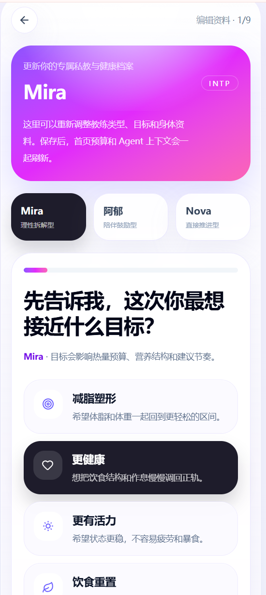
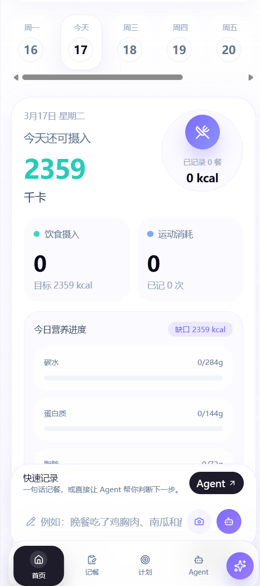
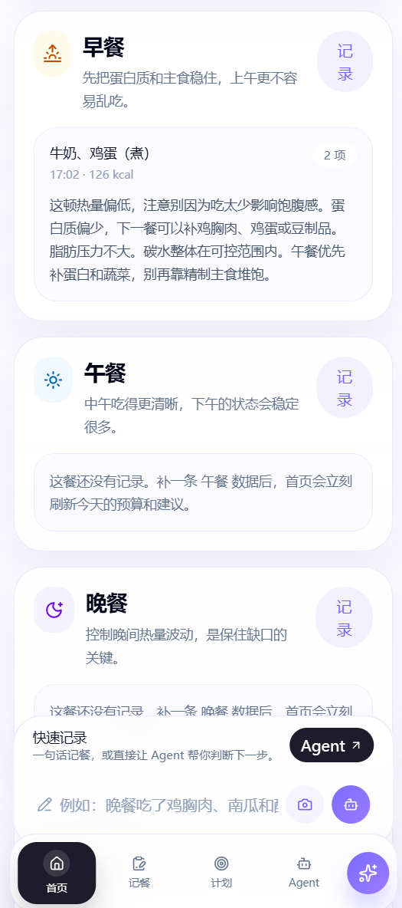
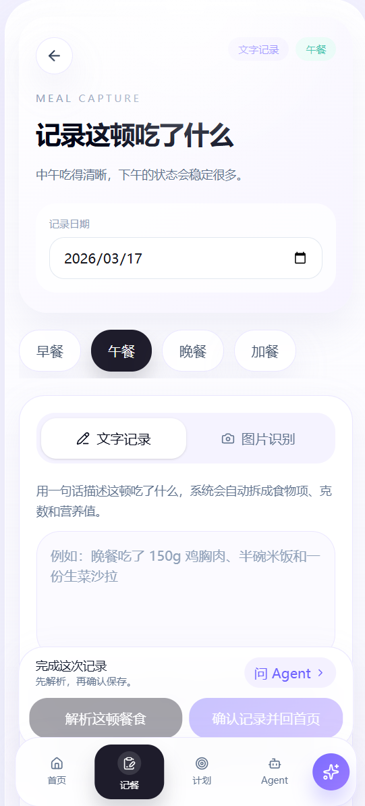
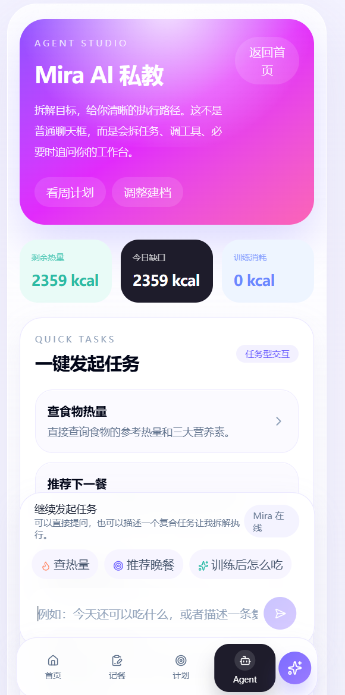
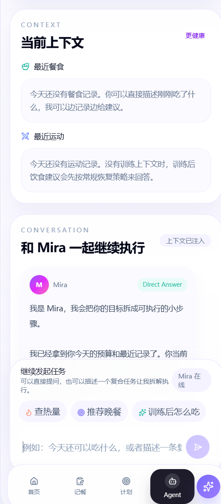
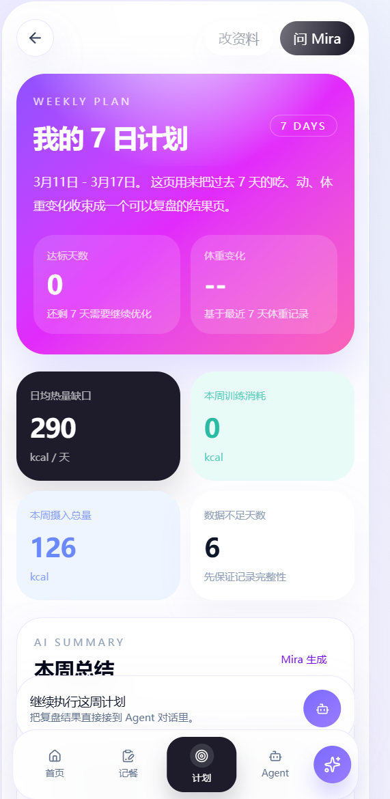
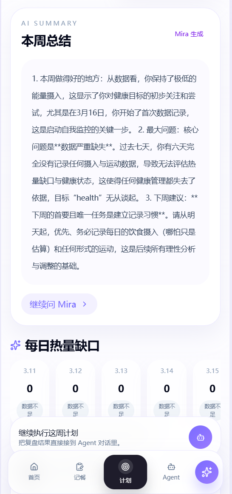
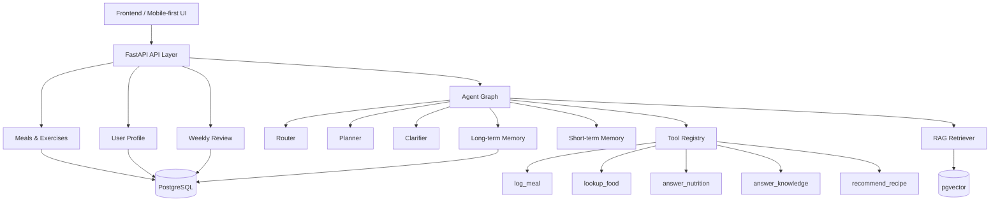

# AI 健康教练


面向减脂与健康管理场景的任务型 AI 应用，支持建档、文本/图片餐食记录、运动记录、热量缺口计算、Agent 对话，以及周计划 / 周复盘。

```text
建档 -> 每日记录 -> 预算分析 -> Agent 建议 -> 周度反馈
```

## Overview

- 真实健康管理闭环，不是普通聊天 Demo
- 支持任务型 Agent 执行，复杂请求可拆解为多步计划
- 支持缺参澄清追问，降低关键字段缺失时的硬答风险
- 基于 `pgvector` 实现轻量 RAG，并结合用户画像与最近行为数据增强建议相关性

## Highlights

| 模块 | 能力 |
|---|---|
| Profile | 教练选择、目标建档、资料更新 |
| Daily Hub | 摄入 / 消耗 / 缺口 / 营养进度 / 餐次组织 |
| Meal Capture | 文本记餐、图片识别、结构化解析 |
| Agent Studio | Router、Planner、Clarifier、Tool Execution |
| Weekly Review | 7 日汇总、AI 总结、长期反馈 |

## Screenshots

### Profile & Onboarding



### Daily Hub




### Meal Capture



### Agent Studio




### Weekly Review




## 技术架构

```text
Frontend (Next.js)
-> FastAPI API Layer
-> Router / Planner / Clarifier / Tool Registry
-> Meal / Exercise / Health / RAG Services
-> PostgreSQL + pgvector
```

### 架构图



### Agent 主链路

```text
User Input
-> Router
-> Direct / Planned / Clarification
-> Planner
-> Tool Registry
-> Executor
-> Response + Plan + Trace
```

### 当前已封装的核心工具

- `log_meal`
- `lookup_food`
- `answer_nutrition`
- `answer_knowledge`
- `recommend_recipe`
- `general_chat`

### Agent 工作流拆解

#### 1. Router

- 识别当前请求属于查热量、记餐、营养分析、知识问答还是推荐下一餐
- 判断请求更适合单步执行还是进入复合任务链路

#### 2. Planner

- 对包含“记录 + 分析”“结合训练 + 推荐一餐”等复合意图生成多步计划
- 每一步显式绑定工具，保证执行路径可解释

#### 3. Clarifier

- 在餐次、分量或训练上下文缺失时触发追问
- 避免模型在关键字段不完整时硬答

#### 4. Tool Execution

- 通过 Tool Registry 统一调度记餐、查热量、知识问答和推荐能力
- 将业务能力从聊天入口中抽离，降低耦合

#### 5. Response + Trace

- 返回最终回答的同时返回 `mode / plan / execution_trace`
- 让前端可以展示 Agent 的执行过程，而不只是最终文本

---

## 核心功能模块

| 功能模块 | 说明 | 技术实现 |
|---|---|---|
| 用户建档 | 采集目标、体重、活动水平、健康史和教练偏好 | `Next.js` 表单流 + `PUT /users/me/profile` |
| 今日工作台 | 展示剩余热量、摄入、消耗、营养进度和餐次记录 | 日汇总计算 + 前端移动端工作台 |
| 餐食记录 | 支持文本解析和图片识别，生成结构化餐食数据 | 文本解析 + Vision + 营养库映射 |
| 运动记录 | 记录训练类型、时长和消耗热量，并影响缺口计算 | `FastAPI` + 日汇总更新 |
| Agent 对话 | 处理查热量、记录餐食、推荐下一餐等任务 | `Router + Planner + Tool Registry + Clarifier` |
| 营养知识问答 | 回答减脂、蛋白质、训练后饮食等知识问题 | 轻量 RAG + `pgvector` 检索 |
| 周计划 / 周复盘 | 汇总最近 7 天执行结果并生成 AI 总结 | 周维度聚合 + LLM 总结 |

---

## 技术栈

### 前端

- Next.js App Router
- TypeScript
- Tailwind CSS

### 后端

- FastAPI
- SQLAlchemy Async
- PostgreSQL
- pgvector

### AI / Agent

- OpenAI-Compatible API
- Prompt Engineering
- Router + Planner + Executor
- Tool Registry
- Human-in-the-Loop Clarification
- 轻量 RAG

---

## 项目结构

```text
NutriAgent/
├── backend/
│   ├── app/
│   │   ├── agents/             # Router / Planner / Clarifier / Tool Registry / Graph
│   │   ├── api/v1/             # meals / exercises / health / chat / users
│   │   ├── models/             # 用户、餐食、运动、记忆等数据模型
│   │   ├── services/           # 餐食、汇总等业务逻辑
│   │   ├── rag/                # 知识导入与检索
│   │   └── vision/             # 图片食物识别
│   └── tests/                  # Agent 相关基础测试
├── frontend/
│   └── src/app/
│       ├── page.tsx            # 今日健康工作台
│       ├── onboarding/         # 教练选择 + 建档
│       ├── meals/              # 餐食记录
│       ├── exercise/           # 运动记录
│       ├── chat/               # Agent 对话页
│       └── review/             # 周计划 / 周复盘
└── docs/assets/                # README 截图资源
```

---

## 快速启动

### 1. 启动基础服务

```bash
docker-compose up -d
```

### 2. 启动后端

```bash
cd backend
conda env create -f environment.yml
conda activate nutriagent-backend
python seeds/load_seeds.py
python -c "import asyncio; from app.rag.ingestion import ingest_all; asyncio.run(ingest_all())"
python -m uvicorn app.main:app --host 127.0.0.1 --port 8001
```

### 3. 启动前端

```bash
cd frontend
npm install

# Windows
set NEXT_PUBLIC_API_BASE_URL=http://127.0.0.1:8001/api/v1

# macOS / Linux
# export NEXT_PUBLIC_API_BASE_URL=http://127.0.0.1:8001/api/v1

npm run dev
```

访问 `http://localhost:3000`

---

## 关键接口

| 方法 | 路径 | 说明 |
|---|---|---|
| `GET` | `/api/v1/users/me/profile` | 获取用户画像 |
| `PUT` | `/api/v1/users/me/profile` | 更新建档信息 |
| `POST` | `/api/v1/meals/parse` | 文本餐食解析 |
| `POST` | `/api/v1/meals/image` | 图片餐食识别 |
| `POST` | `/api/v1/meals/` | 保存餐食记录 |
| `GET` | `/api/v1/meals/daily-summary` | 获取每日营养与热量汇总 |
| `POST` | `/api/v1/exercises/` | 保存运动记录 |
| `GET` | `/api/v1/exercises/` | 获取某日运动记录 |
| `POST` | `/api/v1/chat/` | Agent 统一入口 |
| `GET` | `/api/v1/health/weekly-review` | 获取最近 7 天周复盘 |

---

## 已完成验证

### 后端

```bash
python -m compileall backend\app backend\tests
cd backend
python -m unittest tests.test_agent_planner tests.test_agent_memory tests.test_agent_evaluation -v
```

### 前端

```bash
cd frontend
npm run build
```

---

## 设计取舍

### 1. 任务型 Agent 而不是完全自由聊天

健康管理的高频需求是记录、分析、推荐和复盘，任务边界相对明确。相比完全开放式聊天，任务型 Agent 更容易约束输入输出，也更适合和业务数据联动。

### 2. 规则和结构化数据负责算

热量、营养素、剩余预算和热量缺口等信息需要稳定、可验证，因此优先由结构化数据和规则计算，再交给模型负责解释和建议生成。

### 3. 轻量 RAG，而不是知识平台

这个项目的主轴是健康场景 Agent，不是知识平台。RAG 只负责营养知识增强，不替代餐食记录、热量计算和用户状态等实时业务数据。

### 4. Clarification 先于硬答

在餐次、分量或运动上下文缺失时直接执行，容易让结果失真。先做缺参澄清，可以降低硬答风险，也让 Agent 更接近真实可用系统。
